# 🚀 k8s-cluster-autoscaler

A production-ready **Kubernetes autoscaling** setup for an Express.js REST API, deployed on **AWS EKS** with Horizontal Pod Autoscaler (HPA), Dockerized containerization, and k6 load testing — designed to automatically scale pods under traffic load.

---

## 📁 Project Structure

```
k8s-cluster-autoscaler/
├── public/               # Static assets / frontend
├── Dockerfile            # Container image definition
├── deployment.yaml       # Kubernetes Deployment manifest
├── hpa.yaml              # Horizontal Pod Autoscaler config
├── service.yaml          # Kubernetes Service (LoadBalancer/ClusterIP)
├── load-test.js          # k6 load testing script
├── server.js             # Express.js API server
├── package.json          # Node.js dependencies
└── README.md
```

---

## 🧰 Tech Stack

| Layer | Technology |
|---|---|
| API Server | Node.js |
| Containerization | Docker |
| Orchestration | Kubernetes (AWS EKS) |
| Autoscaling | Horizontal Pod Autoscaler (HPA) |
| Load Testing | k6 |
| Cloud Provider | AWS (EKS, ECR, ELB) |

---

## ⚙️ Prerequisites

- [Node.js](https://nodejs.org/) v18+
- [Docker](https://www.docker.com/)
- [kubectl](https://kubernetes.io/docs/tasks/tools/) configured with your EKS cluster
- [AWS CLI](https://aws.amazon.com/cli/) configured (`aws configure`)
- [k6](https://k6.io/docs/getting-started/installation/) for load testing
- An AWS EKS cluster up and running

---

## 🚀 Getting Started

### 1. Clone the Repository

```bash
git clone https://github.com/lvarshitha7/k8s-cluster-autoscaler.git
cd k8s-cluster-autoscaler
```

### 2. Install Dependencies

```bash
npm install
```

### 3. Run Locally

```bash
node server.js
```

The API will be available at `http://localhost:3000`.

---

## 🐳 Docker

### Build the Image

```bash
docker build -t k8s-cluster-autoscaler .
```

### Run the Container

```bash
docker run -p 3000:3000 k8s-cluster-autoscaler
```

### Push to AWS ECR

```bash
# Authenticate Docker to your ECR registry
aws ecr get-login-password --region <region> | docker login --username AWS --password-stdin <account-id>.dkr.ecr.<region>.amazonaws.com

# Tag and push
docker tag k8s-cluster-autoscaler:latest <account-id>.dkr.ecr.<region>.amazonaws.com/k8s-cluster-autoscaler:latest
docker push <account-id>.dkr.ecr.<region>.amazonaws.com/k8s-cluster-autoscaler:latest
```

---

## ☸️ Kubernetes Deployment

### Deploy to EKS

```bash
# Apply the deployment
kubectl apply -f deployment.yaml

# Apply the service
kubectl apply -f service.yaml

# Apply the Horizontal Pod Autoscaler
kubectl apply -f hpa.yaml
```

### Verify Resources

```bash
# Check pods
kubectl get pods

# Check the service (get the external LoadBalancer URL)
kubectl get svc

# Check HPA status
kubectl get hpa
```

---

## 📈 Horizontal Pod Autoscaler (HPA)

The HPA automatically scales the number of pods based on CPU utilization.

```yaml
# hpa.yaml (summary)
minReplicas: 1
maxReplicas: 10
targetCPUUtilizationPercentage: 50
```

Watch HPA scale in real time:

```bash
kubectl get hpa -w
```

---

## 🔥 Load Testing with k6

Simulate traffic to trigger autoscaling:

```bash
k6 run load-test.js
```

The `load-test.js` script ramps up virtual users and sends requests to the API, which will cause the HPA to detect high CPU usage and spin up additional pods automatically.

Monitor scaling during the test:

```bash
# In a separate terminal
watch kubectl get pods
```

---

## 🌐 API Endpoints

| Method | Endpoint | Description |
|---|---|---|
| GET | `/` | Health check / welcome |
| GET | `/api/pods` | Returns current pod details |
| GET | `/health` | Liveness probe endpoint |

> Pod details endpoint returns metadata about the running pod (name, namespace, node) — useful for verifying autoscaling behavior.

---

## 🏗️ AWS Architecture

```
Internet
   │
   ▼
AWS Elastic Load Balancer
   │
   ▼
Kubernetes Service (LoadBalancer)
   │
   ▼
Express API Pods (auto-scaled by HPA)
   │
   ▼
AWS EKS Worker Nodes (EC2)
```

##🚀 CI/CD Pipeline Architecture

```mermaid
flowchart TD
    %% Define Colors and Styles
    classDef repo fill:#f5f6fa,stroke:#7f8fa6,stroke-width:2px,color:#2f3640;
    classDef jenkins fill:#fbeeb8,stroke:#f1c40f,stroke-width:2px,color:#2c3e50;
    classDef docker fill:#c7ecee,stroke:#22a6b3,stroke-width:2px,color:#2c3e50;
    classDef k8s fill:#c8d6e5,stroke:#54a0ff,stroke-width:2px,color:#2c3e50;
    classDef test fill:#dff9fb,stroke:#badc58,stroke-width:2px,color:#2c3e50;
    classDef cleanup fill:#dcdde1,stroke:#718093,stroke-width:2px,color:#2c3e50;
    classDef success fill:#b8e994,stroke:#78e08f,stroke-width:2px,color:#2c3e50;
    classDef fail fill:#fc5c65,stroke:#eb3b5a,stroke-width:2px,color:#fff;
    classDef decision fill:#fad390,stroke:#e58e26,stroke-width:2px,color:#2c3e50;

    subgraph Source Control
        Git[("🐙 GitHub Repository\n(main branch)")]:::repo
    end

    subgraph Jenkins CI/CD Pipeline
        Clone["📥 Clone Code"]:::jenkins
        
        subgraph Build & Package
            Build["🛠️ Build Docker Image\n(Node.js Express API)"]:::docker
            Push["☁️ Push to Docker Hub\n(lvarshitha7 registry)"]:::docker
        end

        subgraph Local Docker Sandbox
            StopLocal["🛑 Stop Old Container"]:::docker
            RunLocal["▶️ Run New Container\n(Port 3000)"]:::docker
        end

        subgraph Kubernetes Deployment & Config
            DeployK8s["☸️ Deploy to Kubernetes\n(Deployment, Service, HPA)"]:::k8s
            CheckCA{"cluster-autoscaler.yaml\nexists?"}:::decision
            DeployCA["📈 Deploy Cluster Autoscaler\n(kube-system)"]:::k8s
            VerifyDeploy["🔍 Verify Deployment\n(Pods, HPA, Nodes)"]:::test
        end

        subgraph Load Testing & Scaling Validation
            CheckK6{"k6/load-test.js\nexists?"}:::decision
            RunK6["🔥 Run k6 Load Test\n(50 VUs for 2 mins)"]:::test
            VerifyScale["📊 Verify Autoscaling\n(Check Pod/Node scaling)"]:::test
        end

        Cleanup["🧹 Cleanup Docker Images"]:::cleanup
    end

    subgraph Post Build Actions
        Result{"Pipeline Status"}:::decision
        Success["✅ Print Success"]:::success
        Failure["❌ Print Failure"]:::fail
        Always["📝 Print Review Commands"]:::cleanup
    end

    %% Routing
    Git --> Clone
    Clone --> Build
    Build --> Push
    Push --> StopLocal
    StopLocal --> RunLocal
    RunLocal --> DeployK8s
    
    DeployK8s --> CheckCA
    CheckCA -- Yes --> DeployCA --> VerifyDeploy
    CheckCA -- No --> VerifyDeploy
    
    VerifyDeploy --> CheckK6
    CheckK6 -- Yes --> RunK6 --> VerifyScale
    CheckK6 -- No --> VerifyScale
    
    VerifyScale --> Cleanup
    Cleanup --> Result
    Result -- Success --> Success --> Always
    Result -- Failure --> Failure --> Always
```



---

## 🧪 Testing Autoscaling — Step by Step

1. Deploy all manifests to EKS
2. Confirm the API is reachable via the LoadBalancer URL
3. Run the k6 load test: `k6 run load-test.js`
4. Watch HPA react: `kubectl get hpa -w`
5. Watch pods scale up: `kubectl get pods -w`
6. Stop the load test and watch pods scale back down

---

